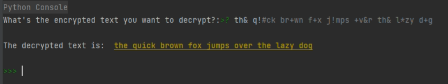

# DECRYPTION
Assignment 2 with commit and readme

A Python Script that will accept a string as encrypted text and then the program will decrypt it using the following character substitute:

'a' = *

'e' = & 

'i' = # 

'o' = +

'u' = !

# Example output

# How To Use / Run
1. Install Python on your computer to run the code. You can download its latest version here: https://www.python.org/downloads/ 
2. Copy the code from the repository. 
3. Open an IDE and paste the code. 
4. Save the file with a .py extension. 
5. Run the code. 
6. It will ask you to enter an encrypted message. Press Enter after inputting your message.
7. The decrypted text will be displayed.
8. If you want to repeat the Decryption just type "YES" if not Type "NO" and after that the program will end and the word "Thank you !!" will appear.
